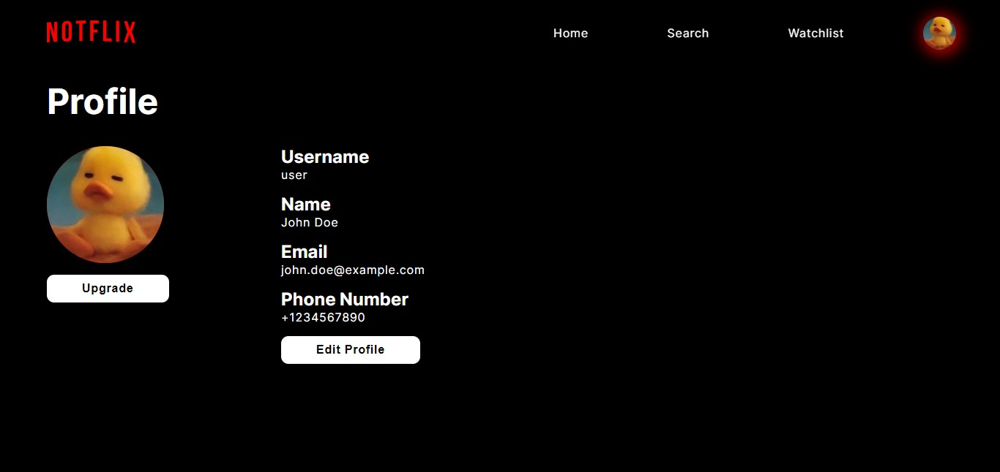

# Deskripsi aplikasi web
Aplikasi web Notflix adalah aplikasi web sederhana yang menyediakan berbagai macam film untuk ditonton dan dapat menambahkan film tersebut ke dalam watchlist user!
Aplikasi ini dibangun menggunakan vanilla PHP, Javascript, HTML dan CSS dengan menggunakan basis data PostgreSQL. 

# Daftar requirement
1. Login
2. Regitrasi
3. Home
4. Search, sort, and filter film
5. Watchlist
6. Watch film
7. Add film
8. Detail film
9. Edit film
10. Delete film
11. User List
12. Delete User
13. Change User Status
14. Add Genre
15. Delete Genre
16. Edit profile

# Cara instalasi
1. Clone repository ini dengan perintah `git clone https://gitlab.informatika.org/if3110-2023-01-34/tugas-besar-1.git`
atau dari github `git clone https://github.com/dhanikanovlisa/Tubes-1-WBD.git`
2. Pastikan komputer anda sudah menginstall PHP, PostgreSQL, Apache, serta Docker
3. Pastikan komputer anda sudah menjalankan aplikasi Docker
4. Lakukan pembuatan image Docker yang akan digunakan oleh aplikasi ini dengan menjalankan perintah docker `build -t tubes-1:latest .` pada terminal directory aplikasi web.
5. Buatlah file .env mengikuti .env.example yang disediakan

# Cara menjalankan server
1. Jalankan perintah `docker-compose up` pada terminal directory aplikasi web
2. Aplikasi web dapat diakses pada `localhost:8080`
3. Aplikasi web dapat dihentikan dengan perintah `docker-compose down` pada terminal directory aplikasi web

# Cara Menggunakan Aplikasi
1. Karena data masih kosong ketika pertama kali dijalankan, masukkan query pada `public/storage/initDB.txt` ke dalam file
`index.php` lalu save
1. Pastikan jika ingin mengupload gambar poster film, gambar tersebut berada pada folder `storage/poster`
2. Pastikan jika ingin mengupload video film, video tersebut berada pada folder `storage/video`
3. Pastikan jika ingin mengupload profile picture, subtitle tersebut berada pada folder `storage/profile`

# Screenshot Aplikasi

# Pembagian Tugas
## Server Side
| Feature             | NIM          |
|---------------------|--------------|
| **Login**           | 13521130     |
| **Registration**    | 13521130     |
| **Home**            | 13521130     |
| **Search, Sort & Filter** | 13521165     |
| **Watchlist**       | 13521165     |
| **Watch Film**      | 13521165     |
| **Add Film**        | 13521132     |
| **Film Details**    | 13521132     |
| **Edit Film**       | 13521132     |
| **Delete Film**     | 13521132     |
| **User List**       | 13521132     |
| **Delete User**     | 13521132     |
| **Change User Status** | 13521132  |
| **Add Genre**       | 13521132     |
| **Delete Genre**    | 13521132     |
| **Edit Profile**    | 13521132     |

## Client Side
| Feature             | NIM          |
|---------------------|--------------|
| **Login**           | 13521130     |
| **Registration**    | 13521130     |
| **Home**            | 13521130     |
| **Search, Sort & Filter** | 13521165     |
| **Watchlist**       | 13521165     |
| **Watch Film**      | 13521165     |
| **Add Film**        | 13521132     |
| **Film Details**    | 13521132     |
| **Edit Film**       | 13521132     |
| **Delete Film**     | 13521132     |
| **User List**       | 13521132     |
| **Delete User**     | 13521132     |
| **Change User Status** | 13521132  |
| **Add Genre**       | 13521132     |
| **Delete Genre**    | 13521132     |
| **Edit Profile**    | 13521132     |
